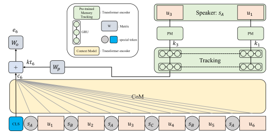

## 💡프로젝트 소개

#### 1️⃣ 주제 : 대화속 감정인식<br>
#### 2️⃣ 설명 : [CoMPM 논문](https://arxiv.org/pdf/2108.11626v3.pdf)을 기반으로 ERC 모델을 구현<br> 
#### 3️⃣ 모델 : Hugging Face [roberta-base](https://huggingface.co/roberta-base) 모델 사용하여 진행<br><br>

## CoMPM 논문 소개
#### CoM(context module) : 입력으로는 대화의 발화들이 전부 들어간다.
#### PM(pre-trained memory module) : CSK와 같이 context-independent발화의 feature을 담아내기 위함이다. <br><br>


<Br><br>
### 부연설명
- 각 발화의 feature는 CLS vector로 추출한다. 
- 이 vector를 GRU를 이용하여 하나의 vector로 만든다.
- Attention-based 결합은 성능이 떨어진다.
- speaker tracking만 한다.
- Listener tracking는 큰 효과가 없다.
- CoM과 PM의 feature vector의 dimension이 다르면 Wp을 이용하여 맞춰준다.

---
## 베이스라인델모델(ft.v1)
### 1. Train 

```
!pip install transformers==4.25.1
!pip install sklearn

!python train.py
```

### 2. Test
```
import torch
from dataset import data_loader
from torch.utils.data import DataLoader

test_dataset = data_loader('./data/test_sent_emo.csv')
test_dataloader = DataLoader(test_dataset, batch_size=1, shuffle=False, num_workers=4, collate_fn=test_dataset.collate_fn)

from model import ERC_model
clsNum = len(test_dataset.emoList)
erc_model = ERC_model(clsNum).cuda()
model_path = './model.bin'
erc_model.load_state_dict(torch.load(model_path))
erc_model.eval()
print('')
```

---
## 모델_v2
### 1. args
```
# 필수지정
p.add_argument('--train_fn', required=True)
p.add_argument('--dev_fn', required=True)
p.add_argument('--test_fn', required=True)
p.add_argument('--save_fn', required=True)

# 기타지정
p.add_argument('--epochs', type=int, default=5)
p.add_argument('--training_steps', type=int, required=False)
p.add_argument('--warmup_steps', type=int, required=False)
p.add_argument('--grad_norm', type=int, default=10)
p.add_argument('--num_workers', type=int, default=4)
p.add_argument('--lr', type=float, default=1e-6)  
```

### 2. train

```
!pip install transformers==4.25.1
!pip install sklearn

!python train_v2.py --train_fn 'data/train.json' --dev_fn 'data/valid.json' --test_fn 'data/valid.json' --save_fn 'checkpoint'
```
### 3. test
```
from error_sample import ErrorSamples 

data_path = "valid.json"
model_path = "checkpoint/checkpoint-4/ERC_model.bin"

error_samples, acc, pred_list, label_list, test_dataset = ErrorSamples(data_path, model_path)
```
#### 1) local test
```
# error sample 확인
import random
random_error_samples = random.sample(error_samples, 10)
     
for random_error_sample in random_error_samples:
    batch_padding_token, true_label, pred_label = random_error_sample
    print('--------------------------------------------------------')
    print("입력 문장들: ", test_dataset.tokenizer.decode(batch_padding_token.squeeze(0).tolist()))
    print("정답 감정: ", test_dataset.emoList[true_label])
    print("예측 감정: ", test_dataset.emoList[pred_label])
```
#### 2) global test
```
true_emotion = []
pred_emotion = []
for error_sample in error_samples:
    batch_padding_token, true_label, pred_label = error_sample
    input_sentence = test_dataset.tokenizer.decode(batch_padding_token.squeeze(0).tolist())
    true_emotion.append(test_dataset.emoList[true_label])
    pred_emotion.append(test_dataset.emoList[pred_label])
    
    
from collections import Counter

data = Counter(true_emotion) # 여기에 true_emotion을 넣을지 pred_emotion을 넣을지 결정함녀 된다.
emotions = list(data.keys())
counts = list(data.values())

# 막대 그래프 그리기
fig, ax = plt.subplots()
ax.bar(emotions, counts) # x축에는 감정 카테고리, y축에는 빈도수를 나타내는 막대 그래프 그리기

ax.set_xlabel('감정')
ax.set_ylabel('빈도')
ax.set_title('감정의 분포')

plt.show()
    
```

---
## 🗓️ 프로젝트 개선 진행

|개선 서비스|진행사항(%)|
|:----------:|:------:|
|한국어 데이터 사용|100%|
|speaker 구분|100%|
|CLS 토큰 위치변경 |불필요|
|special token으로 예측할 발화 추가|100%|
|감정간의 상관관계 고려|불필요|
|모델 저장시 다른 요소 추가|100%|


---
